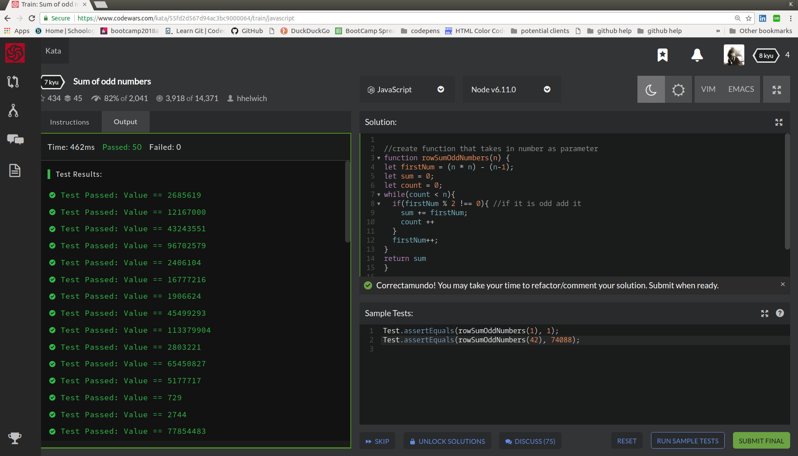

## CodeWars Challenge- 1

1. Given the triangle of consecutive odd numbers:

             1
          3     5
       7     9    11
   13    15    17    19
21    23    25    27    29
...
Calculate the row sums of this triangle from the row index (starting at index 1) e.g.:

*Examples Given:*
1. rowSumOddNumbers(1); // 1
2. rowSumOddNumbers(2); // 3 + 5 = 8

## Languages Used

1. JavaScript

## My solution:

I noticed that each number starting a row was the number squared minus the number minus 1. Each of these would become the variable I called firstNum.  

example: 1 at index 1 -->(1*1) =1 - (1-1) = 1
example: 3 at index 2 --> (2*2) =4 - (2-1) = 3
example: 7 at index 3 --> (3*3) = 9 - (3-1) = 7

The pyramid contains all the odd numbers from 1-29 so I needed a loop. I used a while loop that could iterate through each number, check if it is odd and if it is then the number is added to the variable sum, the count then increments by 1 and so does the firstNum. If the number is not odd then it is not added to the sum, the count does not increment, and instead firstNum increases by one again. This loop repeats itself until count is no longer less than n (the row, or index).
